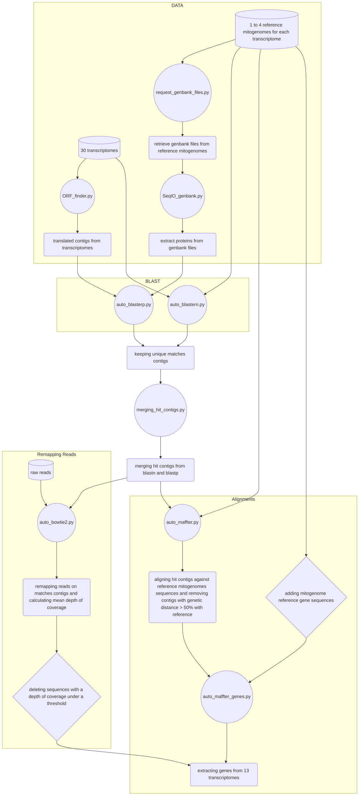

```mermaid
graph TD
data1[(30 transcriptomes)]
data2[(1 to 4 reference mitogenomes for each transcriptome)]
data3[(raw reads)]

step1(keeping unique matches contigs)
step2(retrieve genbank files from reference mitogenomes)
step3(extract proteins from genbank files)
step4(translated contigs from transcriptomes)
step5(merging hit contigs from blastn and blastp)
step6(remapping reads on matches contigs and calculating mean depth of coverage)
step7(aligning hit contigs against reference mitogenomes sequences and removing contigs with genetic distance > 50% with reference)
step8(extracting genes from 13 transcriptomes)

manualstep1{deleting sequences with a depth of coverage under a threshold}
manualstep2{adding mitogenome reference gene sequences}

script1((auto_blastern.py))
script2((auto_blasterp.py))
script3((auto_bowtie2.py))
script4((merging_hit_contigs.py))
script5((ORF_finder.py))
script6((request_genbank_files.py))
script7((SeqIO_genbank.py))
script8((auto_maffter.py))
script9((auto_maffter_genes.py))

subgraph DATA
data2-->script6
script6-->step2
step2-->script7
script7-->step3
data1-->script5
script5-->step4
end
subgraph BLAST
step4 & step3-->script2
data1 & data2-->script1
end
script1 & script2-->step1
step5-->script3
subgraph Remapping Reads
data3-->script3
script3-->step6
step6-->manualstep1
end
step1-->script4
script4-->step5
step5-->script8
subgraph Alignments
data2-->script8
script8-->step7
step7-->script9
script9-->step8
data2-->manualstep2
manualstep2-->script9
manualstep1-->step8
end
```
